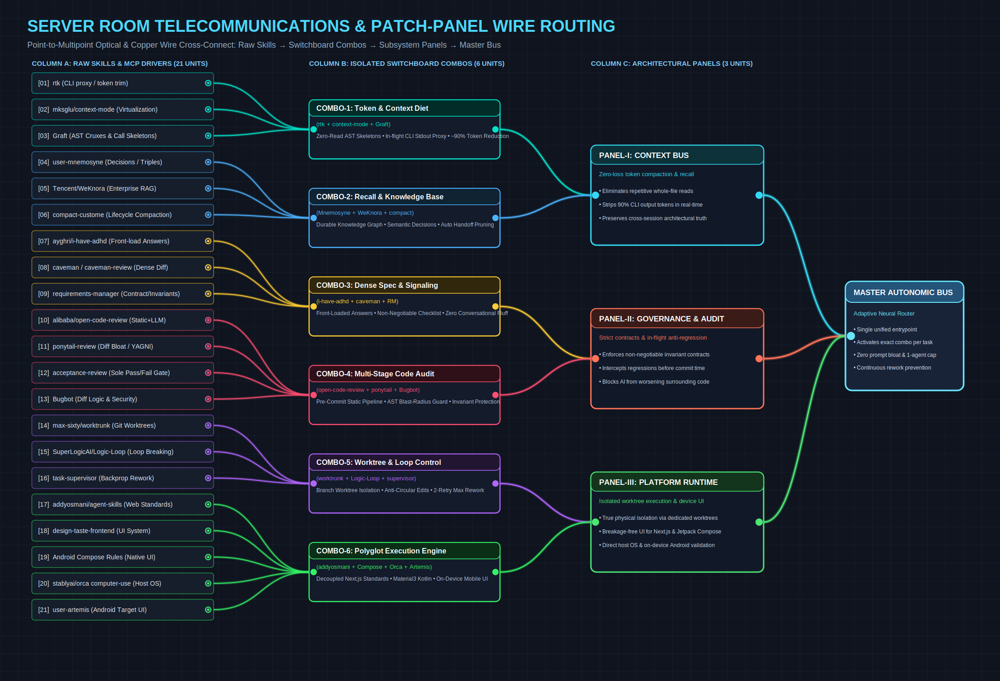
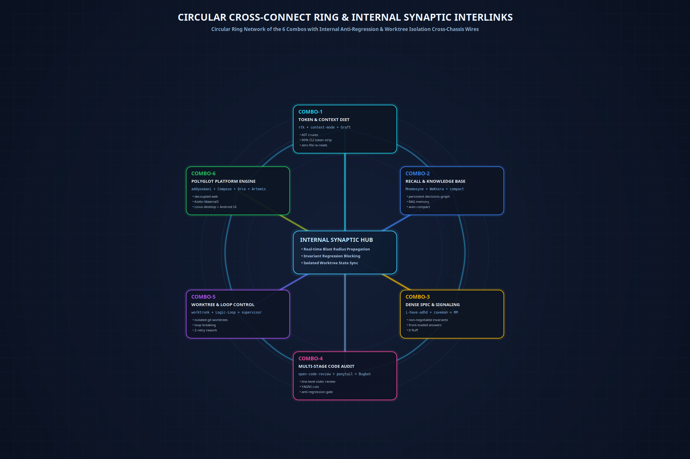

# Bob: Forensic Audit, Anti-Regression & Autonomic Agent Pipeline

> **"You broke Y while doing X" ends here.**

Bob is a forensic audit supervisor, token optimization pipeline, and anti-regression engine for AI-assisted coding agents (Cursor, Claude Code, Codex, Windsurf, OpenCode).

[](LICENSE)
[](https://nodejs.org)
[](https://docs.cursor.com)
[](#token-economics-9093-net-token-reduction)

---

## Table of Contents
1. [The Problem](#the-core-problems-bob-solves)
2. [Architecture & Topology](#architecture--neural-wiring-topology)
3. [The 4-Tier Large Repository Triage](#the-4-tier-large-repository-triage-under-1500-tokens)
4. [Token Economics: 90%–93% Savings](#token-economics-9093-net-token-reduction)
5. [Installation & Setup](#installation--setup)
6. [MCP Configuration](#mcp-configuration)
7. [How to Use Bob](#how-to-use-bob)
8. [Repository Structure](#repository-structure)
9. [Contributing & License](#contributing--license)

---

## The Core Problems Bob Solves

1. **The Rework & Regression Trap**: When an AI agent modifies code to implement or fix feature A, it frequently worsens features B, C, and D because it has no awareness of caller blast radiuses and no invariant protection.
2. **Context Window Exhaustion**: Agents brute-force read 1,000+ line files repeatedly across turns, burning 80,000+ tokens and causing hallucination loops.
3. **Optimistic False "Done" Claims**: Agents declare success after shallow implementations (placeholders, stubs, broken invariants) without proof.
4. **Chat Amnesia & Unstructured Instructions**: Users say *"I asked earlier to do a set of changes but it didn't execute properly"*, and normal agents have no forensic mechanism to audit prior instructions against git reality.

---

## Architecture & Neural-Wiring Topology

Bob integrates 6 specialized, non-interfering tool combos into a unified routing architecture:



```
=======================================================================================================================
                                          BOB TELECOMMUNICATIONS WIRE GRAPH
=======================================================================================================================

 [ COLUMN A: RAW DRIVERS ]                     [ COLUMN B: ISOLATED COMBOS ]                    [ COLUMN C: PANELS ]
 -------------------------                     -----------------------------                    --------------------
 (1) rtk (CLI proxy) ══════════════════╗
 (2) context-mode (Virtualization) ════╬══► [ COMBO-1: TOKEN & CONTEXT DIET ] ═════════════════╗
 (3) Graft (AST Cruxes) ═══════════════╝     (AST Cruxes, 90% CLI token strip)                  ║
                                                                                                ╠══► [ PANEL-I: CONTEXT ]
 (4) Mnemosyne (Decisions) ════════════╗                                                        ║    (Zero-Loss Context Bus)
 (5) WeKnora (Enterprise RAG) ═════════╬══► [ COMBO-2: RECALL & KNOWLEDGE BASE ] ══════════════╝
 (6) compact-custome ══════════════════╝     (Durable Graph, Decisions, Decay)
                                                                                                
 (7) i-have-adhd (Front-load) ═════════╗                                                        
 (8) caveman / caveman-review ═════════╬══► [ COMBO-3: DENSE SPEC & SIGNALING ] ═══════════════╗
 (9) requirements-manager ═════════════╝     (Non-Negotiable Invariants, 0 Fluff)              ║
                                                                                                ╠══► [ PANEL-II: GOVERNANCE ]
 (10) open-code-review (Alibaba OCR) ══╗                                                        ║    (Anti-Regression & Audit)
 (11) ponytail-review (Diff Bloat) ════╬══► [ COMBO-4: MULTI-STAGE CODE AUDIT ] ═══════════════╝
 (12) Bugbot + acceptance-review ══════╝     (Line-Level Static Pipeline, Blast-Radius)         
                                                                                                
 (13) max-sixty/worktrunk ═════════════╗                                                        
 (14) SuperLogicAI/Logic-Loop ═════════╬══► [ COMBO-5: WORKTREE & LOOP CONTROL ] ══════════════╗
 (15) task-supervisor ═════════════════╝     (Branch Worktrees, Loop Breaker, 2-Retry)         ║
                                                                                                ╠══► [ PANEL-III: RUNTIME ]
 (16) addyosmani/agent-skills ═════════╗                                                        ║    (Polyglot Platform)
 (17) design-taste-frontend ═══════════╬══► [ COMBO-6: POLYGLOT PLATFORM ENGINE ] ═════════════╝
 (18) Android Compose / Orca / Artemis ╝     (Decoupled Web, Native Kotlin, Desktop, Android)

=======================================================================================================================
```

### Circular Ring & Cross-Chassis Anti-Regression Wires



* **`COMBO-1` $\longleftrightarrow$ `COMBO-4` (AST Context $\longleftrightarrow$ Multi-Stage Audit)**: Sends real-time symbol call graphs from `Graft` directly to `open-code-review` and `ponytail-review`, calculating the caller blast radius before code edits to prevent regressions.
* **`COMBO-5` $\longleftrightarrow$ `COMBO-6` (Worktree Isolation $\longleftrightarrow$ Polyglot Platform)**: `worktrunk` spins up isolated git worktrees so build servers and desktop automation execute without dirty-state file clashing.
* **`COMBO-3` $\longleftrightarrow$ `COMBO-4` (Locked Spec $\longleftrightarrow$ Invariant Acceptance Gate)**: `requirements-manager` locks non-negotiable invariants, and `acceptance-review` rejects changes if unrelated code is modified.

---

## The 4-Tier Large Repository Triage (Under 1,500 Tokens)

In large codebases (thousands of files), Bob does not run repository-wide `grep` or full-file reads:

1. **Topological Orientation (`graft_repo_map`)**: Obtains module clusters and hotspots in ~300 tokens.
2. **Needle Extraction (`graft_find_code`)**: Extracts only the $\le 8$-line crux definition of the target function.
3. **Blast Radius & Call Graph (`graft_trace_calls`)**: Maps callers and callees in both directions before a single character is edited.
4. **Invariant & Decision Recall (`mnemosyne_recall` + `.cursor/rules/*.mdc`)**: Verifies locked rules and past architectural decisions.

---

## Token Economics: 90%–93% Net Token Reduction

| Step in Debugging / Feature Flow | Traditional Agent Workflow | Bob Autonomic Pipeline | Net Savings |
|---|---|---|---|
| **1. Locating Code** | Reads 3–5 full files (~20,000 tokens) | `graft_find_code` (~500 tokens) | **~97%** |
| **2. Understanding Callers** | Reads caller files (~15,000 tokens) | `graft_trace_calls` AST (~300 tokens) | **~97%** |
| **3. Command Outputs** | Raw build/git stdout (~10,000 tokens) | `rtk` + `context-mode` (~1,000 tokens) | **~90%** |
| **4. Applying Fix** | 400-line rewrite + narrative (~3,500 tokens) | Surgical `StrReplace` (~400 tokens) | **~88%** |
| **5. Rework & Regressions** | Breaks other UI $\rightarrow$ 3 rework turns (~60,000 tokens) | Invariant Locks $\rightarrow$ clean pass on Turn 1 | **100% elimination** |
| **Total Turn Cycle** | **~70,000 – 130,000 tokens** | **~4,000 – 9,000 tokens** | **~92% Net Reduction** |

---

## Installation & Setup

### Prerequisites
- Node.js >= 18.0.0
- npm >= 9.0.0
- Git >= 2.30.0
- (Optional but recommended) Rust/Cargo for `rtk` and `worktrunk`

### 1-Step Automated Installer
Clone the repository and run the automated installation script:

```bash
git clone https://github.com/your-username/bob.git
cd bob
chmod +x ./scripts/install.sh ./scripts/check-mcp.sh
./scripts/install.sh
```

This will automatically:
1. Copy `skills/bob/SKILL.md` to `~/.cursor/skills/bob/SKILL.md`.
2. Copy `rules/bob.mdc` to `~/.cursor/rules/bob.mdc`.
3. Install `context-mode` and `@alibaba-group/open-code-review` globally.
4. Install `rtk` via Cargo (if Cargo is present).

### Health Check Diagnostic
Verify your tool connectivity at any time:
```bash
./scripts/check-mcp.sh
```

---

## MCP Configuration

Bob orchestrates the following MCP servers. Add them to your Cursor (`Settings` $\rightarrow$ `Features` $\rightarrow$ `MCP`) or Claude Desktop config (`claude_desktop_config.json`):

```json
{
  "mcpServers": {
    "graft": {
      "command": "graft",
      "args": ["mcp"],
      "description": "Codebase AST, symbol definition cruxes, and blast-radius call graphs"
    },
    "mnemosyne": {
      "command": "mnemosyne",
      "args": ["mcp"],
      "description": "Persistent project memory, decisions graph, and cross-session triples"
    },
    "context-mode": {
      "command": "npx",
      "args": ["-y", "context-mode"],
      "description": "Virtualizes large tool command outputs, saving up to 98% context window tokens"
    },
    "code-review": {
      "command": "npx",
      "args": ["-y", "@alibaba-group/open-code-review", "mcp"],
      "description": "Alibaba deterministic and LLM-assisted line-level PR/git diff review"
    }
  }
}
```

---

## How to Use Bob

Bob is always on in your environment. You can call Bob directly in chat whenever an implementation goes sideways or needs an audit:

* **Audit a failed instruction**:
  > *"bob, I asked earlier to do a set of changes but it didn't execute properly"*
* **Audit against regressions**:
  > *"bob, check what broke in the last commit and why the test failed"*
* **Direct invariant check**:
  > *"bob audit"*

### What Bob Executes Under the Hood:
1. **Reconstructs Intent**: Extracts the unvarnished initial contract from conversation history and `.cursor/REQUIREMENTS.md`.
2. **Code Reality Check**: Runs `git status`, `git log -n 5 --stat`, and `git diff HEAD~1` to see what code was actually changed.
3. **Forensic Blame & Gap Analysis**: Returns a structured report with:
   * **Fulfilled**: What was done right.
   * **Omitted / Shallow**: What was skipped, stubbed, or left incomplete.
   * **Regressions**: Unintended side-effects and broken invariants.
   * **Root Cause**: Why the failure happened.
4. **Correction Order**: Issues an actionable numbered action list (`FIX-001`, `FIX-002`) with locked invariants before any code is modified.

---

## Repository Structure

```
bob/
├── README.md                          # Full architectural manual & token economics
├── CONTRIBUTING.md                    # Guidelines for contributing to Bob
├── LICENSE                            # MIT License
├── package.json                       # Project metadata & npm scripts
├── mcp-config.example.json            # Reference MCP server configurations
├── scripts/
│   ├── install.sh                     # Automated 1-step installer
│   └── check-mcp.sh                   # MCP & driver connectivity diagnostic tool
├── bin/
│   └── bob-audit                      # Standalone CLI forensic audit script
├── skills/
│   └── bob/
│       └── SKILL.md                   # Core forensic audit & correction skill
├── rules/
│   └── bob.mdc                        # Cursor always-on trigger rule
└── diagrams/
    ├── 01_switchboard_wire_graph.png  # Switchboard telecommunications wire graph
    └── 02_circular_ring_crossconnect.png # Circular cross-connect ring diagram
```

---

## Contributing & License

Contributions are welcome! Please read [CONTRIBUTING.md](CONTRIBUTING.md) for setup and pull request guidelines.

Distributed under the [MIT License](LICENSE).
